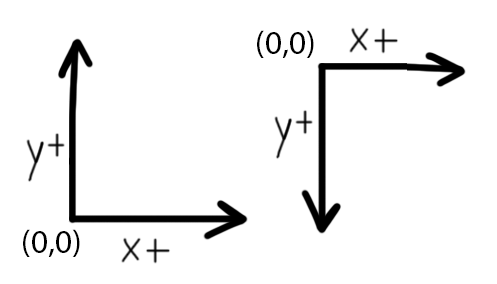

# Tic Tac Toe

Write a program that allows two players to play a game of Tic Tac Toe.

Here's everything we'll need to do for this program:

* Represent the board
* Display the board
* Keep track of who's turn it is
* Allow players to make moves
* Prevent players from making impossible/illegal moves
* Detect when the game has ended

Most of these items will be accomplished without much trouble. Our biggest
challenge will be writing code to detect when the game has ended. Let's build
up the game then see what it takes to detect end-game conditions.

If you want to skip to the complete version, go right to repl
[repl.it](https://repl.it/@geluso/Tic-Tac-Toe)!

## Two-Dimensional Array Coordinates
Let's start with the board representation. A two-dimensional array is a great
choice for this grid game. Here's a 3x3 grid filled with `None` values to
represent an empty board. Let's practice accessing different spots on the
board to make sure we've got our coordinates all figured out.

```
board = [
  [None, None, None],
  [None, None, None],
  [None, None, None],
]
```

We're saving the entire two-dimensional grid in to a variable called `board`.
The board has three rows going from top to bottom, and three columns going
from left to right.

To access the top-left corner of the board we access `board[0][0]`. It's in
the first row, in the first column. The grid is an array of arrays. That is
to say, the `board` variable itself refers to one array. That array contains
three things. Each of those things is an array itself. Each of the inner
arrays has three empty spots.

* The top left corner is at index `board[0][0]`
* The middle spot is at index `board[1][1]`
* The bottom left corner is at index `board[2][0]`
* The middle bottom spot is at index `board[2][1]`
* The bottom right corner is at index `board[2][2]`



If you come from a background dealing with (x,y) coordinates with lines and
graphs like in a math class you might notice something odd here. In math
classes we draw a graph with the origin `(0,0)` in the bottom left corner.
The graph has two axes: one for `x` extending to the right, and one for `y`
extending up. In a math graph y values start at zero at the bottom and
increase as they go up. In our Tic Tac Toe grid our "y" row indexes go up
in the opposite direction. Our vertical row coordinates start at zero at the
top of the grid, and they increase as they go toward the bottom.

Often in computer graphics the top of the screen is where y-coordinates start.
They start at the top as zero and increase as they move down the screen. Think
of it like the way you read a book. You start at the top left corner of a page
and read left-to-right, then top-to-bottom.

Since I'm personally used to y-coordinates increasing as they go up I strive
to refer to array indexes with the words "row" and "column," especially in
strictly grid-like structures. It makes it easier for me to reason about
where things are located.

## Game Engine
Now that we've determined how to represent the state of the board we can
think about what sort of interactions we need to have with the game. Let's
make a class that represents a game of Tic Tac Toe. The class needs methods
to determine if the game is over, allow players to make moves, and keep track
of who wins at the end of the game.

Here's a simplified version of how the main program will use this class. The
most important methods here are `is_game_over`, and `make_move`. The class will
have more methods used by itself internally.

```python
game = TicTacToeGame()
while not game.is_game_over():
  row, col = prompt_player(game)
  game.make_move(row, col)
  display_board(game)
display_winner(game)
```

Most of the complexity of this main program has been abstracted away with the
methods `prompt_player`, `display_board` and `display_winner`. You can assume
those methods access properties on the `TicTacToeGame` class, and perform
sufficient input and output.

Here's an outline of the whole `TicTacToeGame` class:

```python
class TicTacToeGame:
  winner = None
  is_game_over = false

  turn = 0
  players = ['X', 'O']

  board = [
    [None, None, None],
    [None, None, None],
    [None, None, None]
  ]

  reset_game()
  make_move(row, col)

  get_current_player()
  is_game_over()
  get_winner()

  is_valid_move(row, col)
  check_game_over()
}
```

The class has state for if the game is over and who won. It has an integer
variable `turn` to count what turn number it is. It will use the `turn`
number to determine which player's turn it is. The `players` array stores the
two players in the game, represented as the strings `"X"` and `"O"`.

The class has a `board` property referring to the 3x3 two-dimensional array,
and it has methods to manipulate everything when moves are made.

Notice there's more methods in the class than there are used in the miniature
main concept program above. Specifically, the `is_valid_move` and
`check_game_over` will never be called from the main program. These are
internal methods that will only be called from other methods inside the
class. These will be called from inside `make_move()` which is called from the
main program.

Programming languages often call the different between externally-used and
internally-used methods `public` and `private` methods.

Read more about [encapsulation]().

## Making Moves and Taking Turns
Let's implement `make_move(row, col)`. This method accepts a position on the
board and marks the spot with an `"X"` or an `"O"`. It depends on knowing
which player is currently making the move. It should only count the move if
the player has chosen a legitimate row and column on the board, and it should
prevent the player from overwriting a move already made at a position. If the
move is legitimate then the board is marked, and the next time the method is
called it is the next player's turn.

In summary:

* Have the current player attempt to make a move
* Double-check to make sure the move is legitimate
* Manipulate the state of the game as per the move
* Advance the state of the game to the next player

How do we keep track of what player's turn it is? Use the `turn` number to
constantly cycle through the array of `players` whenever a legitimate turn is
complete. There's a nice pattern we can use with the modulus operator to
achieve this cleanly.

If we always increment the `turn` number and take the modulo of it and the
length of the `players` array then we will get a number that cycles through
each of the array indexes, starting at zero, going to the end and repeating
over and over.

Check out this example:

```python
# referring to a Star Trek TNG poker scene
# https://www.youtube.com/watch?v=XRE9HNUmdtA
players = ['Beverly', 'Riker', 'Geordie', 'Worf', 'Data']
turn = 0
while turn < 42:
  index = turn % players.length
  player = players[index]
  print('current player:', player)

  turn += 1
```

**Takeaway:** You can always use an integer, an array, and the modulus
operator to proceed through player turns in an orderly fashion until a game
is over. When you take the turn number "modulo" the length of the array you
end up with a number sequence that cycles through indexes of the array.

Here's an example using modulus in a two player game, and a five player game.
No matter how many players are in the game this will always work.

(Well, technically there's one specific thing that could cause this to
hiccup. Read more about [Integer Overflow](). Practically it would only
happen if your game lasted many, many, many turns.)


| Turn | turn % 2    | Two Players | turn % 5    | Five Players |
| ---- | ----------- | ----------- | ----------- | ------------ |
| 0    | 0 % 2 == 0  | Alice       | 0 % 5 == 0  | Beverly      |
| 1    | 1 % 2 == 1  | Bob         | 1 % 5 == 1  | Riker        |
| 2    | 2 % 2 == 0  | Alice       | 2 % 5 == 2  | Geordie      |
| 3    | 3 % 2 == 1  | Bob         | 3 % 5 == 3  | Worf         |
| 4    | 4 % 2 == 0  | Alice       | 4 % 5 == 4  | Data         |
| 5    | 5 % 2 == 1  | Bob         | 5 % 5 == 0  | Beverly      |
| 6    | 6 % 2 == 0  | Alice       | 6 % 5 == 1  | Riker        |
| 7    | 7 % 2 == 1  | Bob         | 7 % 5 == 2  | Geordie      |
| 8    | 8 % 2 == 0  | Alice       | 8 % 5 == 3  | Worf         |
| 9    | 9 % 2 == 1  | Bob         | 9 % 5 == 4  | Data         |
| 10   | 10 % 2 == 0 | Alice       | 10 % 5 == 0 | Beverly      |
| 11   | 11 % 2 == 1 | Bob         | 11 % 5 == 1 | Riker        |
| 12   | 12 % 2 == 0 | Alice       | 12 % 5 == 2 | Geordie      |
| 13   | 13 % 2 == 1 | Bob         | 13 % 5 == 3 | Worf         |

Make one method `get_current_player` that uses modulus with `turn` and the
`players` array to return either `"X"` or `"O"` for the current player.

Create a method `is_valid_move(row, col)` that checks the bounds of the row and
column indexes, and checks to make sure no one has played at that position
before. To check the row and column indexes just make sure the numbers are no
less than zero and no greater than two. Check to see make sure the place on
the board is empty by verifying it's value is `None`.

Now we can use these two helper methods inside the `make_move(row, col)` method.
First, use `is_valid_move(row, col)` to pass the row and column coordinates
through to make sure the move is possible. If the move is not possible simply
return from the method without having changed the state of the game at all.
The main program outside this class will need to detect that it is still the
same players turn and prompt them to make a legal move.

If the move is valid then it's save to mark the board. The
`get_current_player()` method retrieves either an `"X"` or an `"O"` and saves
that value to the position on the board.

After a legitimate move has been made and a mark has been left the `make_move`
method should increment the `turn` number and run logic to see if the game
has ended.

Here's the code all together. We'll look more at creating the `check_game_over`
method next.

```python
def get_current_player(self):
  index = self.turn % self.players.length
  return self.players[index]

def is_valid_move(row, col):
  # make sure indexes are legitimate array indexes within the grid
  if (row < 0 or col < 0 or row >= 3 or col >= 3) {
    return False

  # make sure the spot on the grid hasn't already been taken
  if (board[row][col] is not None) {
    return False
  return True

def make_move(row, col):
  if self.is_valid_move(row, col):
    # mark the board with the current player ("X" or "O")
    self.board[row][col] = self.get_current_player()
    self.turn += 1

    # check to see if the move ended the game
    self.check_game_over()
```

## Checking For Game Over
OK, now we've got a class set up to represent the whole Tic Tac Toe game. The
class uses a two-dimensional array to represent the board. It's got methods
that allow players to make moves, it increments through player turns
smoothly, and makes sure players only make legitimate moves. Let's figure out
when this thing ends!

When does Tic Tac Toe end?

* A player wins when a player gets three in a row.
* Players tie when the board fills up no threes-in-a-row

I apologize for having explained end-game conditions for Tic Tac Toe. If
you've seriously never played Tic Tac Toe, welcome to the game!

Now let's translate our end-game conditions into code.

Detecting the "cat's games" as the end-game tie condition is easier than
looking everywhere on the board for three-in-a-rows. Since our game only
increments the `turn` counter when legitimate moves are made we know that
ties will always occur at the end of turn nine if there's not a
three-in-a-row (or is it eight because we start at zero? Watch out for
off-by-one-errors!).

Detecting three things in a row on our grid requires looking at lots of
different places on the board. This seems like a job for for-loops. Let's
write code using for-loops first, then we'll explore a simpler solution.

### Asserting Three-in-a-row
Let's consider the logic to check if there's three things in a row. We need
to account for mixtures of three values: `Nones`, `Xs` and `Os`.

We know there's three in a row if the first one matches the second, and if
the second matches the third. We don't need to check to see if the first
matches the third because we're already comparing both the first and the
third to the second.

We could get false positive in our program if we accidentally counted three
`Nones` in a row as winning. Let's add one more piece of logic to make sure
that the first spot is not empty, `None`.

Let's see how this logic holds up against some examples. It's nice to be
thorough and really write out all these variations to make sure our logic is
correct.

* `[X, X, X]` #1 is not None, #1 matches #2, #2 matches #3. X wins.
* `[X, X, O]` #1 is not None, #1 matches #2, #2 does not match #3. No win due to a not-match.
* `[X, X, None]` #1 is not None, #1 matches #2, #2 does not match #3. No win due to a not-match.
* `[X, None, X]` #1 is not None, #1 does not match #2, #2 matches #3. No win due to a not-match.
* `[None, X, X]` #1 is None, #1 does not match #2, #2 matches #3. No win due to a not-match.
* `[None, None, None]` #1 is None, #1 matches #2, #2 matches #3. No win due to #1 being None.

Here is logic checking to see if there's three-in-a-row across the top row:

```python
is_not_none = board[0][0] is not None
three_in_a_row = board[0][0] == board[0][1] and board[0][1] == board[0][2]
return is_not_none and three_in_a_row
```

### Traversing Arrays
Now that we have the logic to detect three-in-a-row we need to check for
three-in-a-row everywhere on the board. Three-in-a-rows appear in three (or
four?) different patterns:

1. From left to right across a row (on the top, middle, or bottom rows)
1. From top to bottom along a column (along the left, middle, or right columns)
1. From top-left to bottom-right in a diagonal
1. From bottom-left to top-right in a diagonal

First we write a for-loop to check each row. The loops needs to move across
all three rows and check to see if the three spots all match each other.

Checking for three-in-a-row across columns is (exactly) similar, so there's a
for-loop that moves across columns in the same way too.

```python
# check each row for three-in-a-row across
for row in range(3):
  is_not_none = board[row][0] is not None
  three_in_a_row = board[row][0] == board[row][1] and board[row][1] == board[row][2]

  if is_not_none and three_in_a_row:
    return True

# check each column for three-in-a-row down
for col in range(3):
  is_not_none = board[0][col] is not None
  three_in_a_row = board[0][col] == board[1][col] and board[1][col] == board[2][col]

  if is_not_none and three_in_a_row:
    return True
```

Ah, but there's redundant logic inside the for-loops! It's annoying to have
to write the same code inside the two for-loops twice. We can write a function
to capture this logic.

This function checks three spots on the board and returns `true` or `false`
if all the spots match each other, and they are not `None`.

Read more about [Reducing Redundant Redundancy]() and why it can be a great thing.

```python
def check_three(row1, col1, row2, col2, row3, col3):
  is_not_none = board[row1][col1] is not None
  three_in_a_row = board[row1][col1] == board[row2][col2] and board[row2][col2] == board[row3][col3]

  if is_not_none and three_in_a_row:
    return True
  return False
```

### False Optimization
An astute reader will notice that the `check_three` function above can be
"optimized," specifically around condensing the if-statement that takes up
four whole lines.

```python
def check_three(row1, col1, row2, col2, row3, col3):
  is_not_none = board[row1][col1] is not None
  three_in_a_row = board[row1][col1] == board[row2][col2] and board[row2][col2] == board[row3][col3]
  return is_not_none and three_in_a_row
```

The astute reader will realize the code can be "optimized" even further.

```python
def check_three(a,b,c,d,e,f):
  return board[a][b] is not None and board[a][b] == board[c][d] and board[c][d] == board[e][f]
```

This reader is a dolt, a coward, they are missing the forest for the trees,
seeing a finger for the moon, and prioritizing having less lines-of-code over
striving for clarity, investigatibility, and maintainability. This is a false
optimization, a bad habit, and no one wants to talk to these people at
parties.

Basically squishing code together like this just makes things harder to
understand and much harder to debug and log and interact with in the future.

Spreading code out across multiple lines (especially the hard-coded `true`
and `false` individual return statements) make it easy to observe what path
your program takes if you watch it execute it line-by-line with a debugger.

Saving boolean values into variables like `is_not_none` and `three_in_a_row`
is a great way simply to describe what logic check your performing. The next
person that reads the code (especially future-you) can quickly see what
you're trying to determine just by the name of the variable. Good debuggers
will let you see the value of the variable too, so it's nice to be able to
pause the program and see the result of those logics.

You're probably going to extend the program in the future and rewrite this code anyway.
Breaking code across many variable and across many lines will give you more
"contact points" in the future. More places to "hook up wires" or "weld stuff
on."

Read more about [One-Liners Suck]()

And another one thing!! Tiny variable names are absolutely terrible. Imagine
searching through a code-base to see everywhere a variable, or a function is
called. If you named something `a` you're going to get a lot of useless
search results like "banana," "banana," "banana," "bandanna," "bandanna,"
"bandanna," "a = 78", "search," and so on.

### All Together
Here's all the win checks together. There's a for loop to check across the
rows, a for-loop to check all the columns, and two one-offs to check the two
diagonal lines across the board.

It's correct and it totally works. Still, something about it doesn't feel
like the best way to do things. I especially don't like the repetitive
if-statements that happen over and over.

In the next section we will see how to abstract all these line checks
together into one simple for-loop that checks totally everything.

```python
# check each row for three-in-a-row across
for row in range(3):
  if check_three(row, 0, row, 1, row, 2):
    return True

# check each column for three-in-a-row down
for col in range(3):
  if check_three(0, col, 1, col, 2, col):
    return True

# check diaganols
# top-left to bottom-right
if check_three(0, 0, 1, 1, 2, 2):
  return True

# bottom-left to top-right
if check_three(2, 0, 1, 1, 0, 3):
  return True

return False
```

## A More Complex Simple Solution
The problem with the last approach is that we're over-solving the problem. We
did a great job writing for-loops to check across all the rows, and all the
columns, but the truth of the matter is there's not many rows or columns to
check! There's not much bang-for-our-buck in those two for loops that each
execute exactly three times.

Instead of trying to capture the redundancy of checking the three rows and
the three columns with for-loops let's bite the bullet and hard code every
line of three-in-a-row as an array of three coordinates.

Make a list of all three-in-a-row positions, then use the `check_three`
function to see if any of those lines are winners. Since there's only eight
lines it isn't too bad to hard-code this all in to our program.

We'll look at more complicated grid-assessments when we look at Connect Four
in the next game.

If our Tic Tac Toe board was very tall or very narrow it would make sense to
write those for-loops to iterate over many of them to check for
three-in-a-rows. Here we can see that's it is not totally bad to hard code
all the lines out because there's not many of them.

Standardizing all of the lines in the same format (an array of coordinates)
allows us to put all of the lines in one array and iterate through them all
identically so we only need to write one if-statement to see if that line is
a winner.

```python
def has_winner():
  lines = [
    # horizontal lines 
    [0, 0, 0, 1, 0, 2],
    [1, 0, 1, 1, 1, 2],
    [2, 0, 2, 1, 2, 2],

    # vertical lines
    [0, 0, 1, 0, 2, 0],
    [0, 1, 1, 1, 2, 1],
    [0, 2, 1, 2, 2, 2],

    # top-left to bottom-right
    [0, 0, 1, 1, 2, 2],

    # bottom-left to top-right
    [2, 0, 1, 1, 0, 2]
  ]

  for line in lines:
    if check_three(line[0], line[1], line[2], line[3], line[4], line[5]):
      return True
  return False
```

## Detecting End-Game vs Detecting A Winner
We've done a great job writing code checking for three-in-a-rows. We can
totally find out when the game ends. One thing we haven't really accounted
for is finding out _who_ the winner was when the game is done!

We could change the `check_three` function so that instead of returning `true`
or `false` it could also return a string representing the winner like `"X"`,
`"O"`, or `"tie"`. This isn't the best idea, just because it involves the
function returning sometimes boolean values, and sometimes string values.
It's generally good practice to have a function only return one type of value
(in fact more-strict languages don't even allow a function to possibly return
mixed types!)

In the case of Tic Tac Toe we can take advantage of the nature of the game to
determine the winner. That is, the winner will always be the last player to
make a move. There's never going to be a situation when `"X"` plays and then
`"O"` somehow gets three-in-a-row.

Let's add logic to the `make_move` method to check for wins immediately after
a player makes a move and set that player as the winner if the game is won.

Pay attentions to where the `turn` number is incremented. We're only
incrementing it if there's not three-in-a-row and if there's not a tie. It
could be too easy to make a silly order-which-things-occur mistake and
somehow mark an incorrect player as the winner if we mixed up the order of
incrementing the `turn` number and the call to `get_current_player()`.

When we detect that there's a win we update the state of the game so `winner`
stores the winning player, and the `is_game_over` flag is set to true. Notice
that I added another small if-statement to the beginning of the `make_move()`
function that checks to see if the game is over. This is a small idiot-check
I like to leave in to prevent the game from getting in to a corrupt state
after a game has ended. Why should anyone be allowed to make a move if the
game is over?
 
```python
make_move(row, col):
  if self.is_game_over:
    return

  if self.is_valid_move(row, col):
    # mark the board with the current player ("X" or "O")
    player = self.get_current_player()
    self.board[row][col] = player

    # check to see if the move ended the game
    if self.has_winner():
      self.is_game_over = True
      self.winner = player
    else if self.turn == 9:
      self.is_game_over = True
      self.winner = 'tie'
    else:
      self.turn += 1
```

## Wiring Our Engine to Input/Output
We have a working Tic Tac Toe game engine! Let's hook it up so we can play!

First let's decide how we want the game to appear. I'm going to continue
using an ASCII terminal environment. The main program will print out the
board and ask the user to type in something and press enter to make their
moves.

I don't want the user to have to enter something like `0,0` to make a move on
the top left of the board, so I'm coming up with a scheme to make their life
a bit easier. I'm labeling each spot on the board with a letter the user can
type in to make their moves. I'll write a function in the program maps each
letter to row column indexes. (Sorry if you're not using a US keyboard. These
letters are all together on the left-hand side of a US keyboard.)

Using a dictionary to create this mapping is the perfect tool for the job.

```txt
 q | w | e
---+---+---
 a | s | d
---+---+---
 z | x | c
```

```python
def letter_to_coordinate(letter):
    mapping = {
        "q": (0, 0), "w": (0, 1), "e": (0, 2),
        "a": (1, 0), "s": (1, 1), "d": (1, 2),
        "z": (2, 0), "x": (2, 1), "c": (2, 2),
    }
    return mapping[letter]
```

Overall I want the game to look like this. The program shows the board, it
shows the keys to enter next to the board, it shows who's turn it is (either
X or O) and prompts the user to enter a letter.

```txt
   |   |     q w e
---+---+---
   |   |     a s d
---+---+---
   |   |     z x c

X: enter your move:
```

The main program needs a function `display_board` to read each spot on the
board from the 2D array and print it out properly. It needs to print Xs and
Os when spots are filled in.

```txt
 X | X | O   q w e
---+---+---
   | O |     a s d
---+---+---
 X |   |     z x c

O: enter your move:
```

Printing the board out is rarely pretty code. I'm taking advantage of
Python's ability to unpack an array into variables, and using Python's string
formatting to render the value of variables into a string template.

I'm taking advantage of Python's list comprehensions too. Python list
comprehensions allow you to take one list and generate another list on the
fly. Let's look at what's happening line by line.

First, the program accesses the first row at `game.board[0]`. There are three
things in that row. Python unpacks the array of three things into the three
variables `q, w, e`. `q` gets the first item, `w` gets the second item, `e`
gets the third item.

```python
q, w, e = game.board[0]
```

The first time I rendered these values into the board I ended up getting a
board that looks like this. I forgot that the board contains `None` values
initially.

```txt
 None | None | None   q w e
 ---+---+---
 None | None | None   a s d
 ---+---+---
 None | None | None   z x c
```

I need to write code that detects if each variable is equal to `None` and
replaces it with an empty string `" "` instead.

```
if q is None:
    q = " "
if w is None:
    w = " "
if e is None:
    e = " "
```

This gets repetitive, especially because I have to do it for every single one
of the nine variables. The list comprehension is a fancy way Python allows us
to write this all extremely succinctly.

This basic list comprehension iterates over the three-item list in
`game.board[0]` and adds an exclamation mark at the end of each string. This
is just a small example to show you what a simple list comprehension looks
like.

```python
[mark + "!" for mark in game.board[0]]
```

The whole list comprehension I use include an if-else statement. The if else
statement will return an empty string `" "` if the `mark` on the board is equal
to `None`, otherwise it will return the value of `mark`, which will be either
`"X"` or `"O"`.

So. `game.board[0]` accesses the first row for three things. The list
comprehension iterates over that list of three things and creates a new
list of three things. The new list is equal to the old list, but it has
empty strings where `None` values were in the original list. Finally, Python
unpacks the list of three things into the three variables. Then they're all
ready to render into the string templates that make up the whole board.

I could have done this all with more simple code and that would have been
totally fine. The program would have behaved exactly correctly. It just that
sometimes it's fun and satisfying to take advantage of special features like
these!

```python
def display_board(game):
    # [f(x) if condition else g(x) for x in sequence]
    q, w, e = [' ' if mark is None else mark for mark in game.board[0]]
    a, s, d = [' ' if mark is None else mark for mark in game.board[1]]
    z, x, c = [' ' if mark is None else mark for mark in game.board[2]]

    lines = [
        "",
        " %s | %s | %s   q w e" % (q, w, e),
        "---+---+---",
        " %s | %s | %s   a s d" % (a, s, d),
        "---+---+---",
        " %s | %s | %s   z x c" % (z, x, c)
    ]

    for line in lines:
        print(line)
```

## Source Code

View it on [repl.it](https://repl.it/@geluso/Tic-Tac-Toe)

**main.py**
```python
from tic_tac_toe_game import TicTacToeGame


def display_board(game):
    # [f(x) if condition else g(x) for x in sequence]
    q, w, e = [' ' if mark is None else mark for mark in game.board[0]]
    a, s, d = [' ' if mark is None else mark for mark in game.board[1]]
    z, x, c = [' ' if mark is None else mark for mark in game.board[2]]

    lines = [
        "",
        " %s | %s | %s   q w e" % (q, w, e),
        "---+---+---",
        " %s | %s | %s   a s d" % (a, s, d),
        "---+---+---",
        " %s | %s | %s   z x c" % (z, x, c)
    ]

    for line in lines:
        print(line)


def letter_to_coordinate(letter):
    mapping = {
        "q": (0, 0), "w": (0, 1), "e": (0, 2),
        "a": (1, 0), "s": (1, 1), "d": (1, 2),
        "z": (2, 0), "x": (2, 1), "c": (2, 2),
    }
    return mapping[letter]


def prompt_player(game):
    player = game.get_current_player()

    prompt = "%s: enter your move: " % player
    print(prompt, end="")

    letter = input()
    coordinate = letter_to_coordinate(letter)
    return coordinate


def display_winner(game):
    display_board(game)
    if game.winner in game.players:
        print("%s wins!" % game.winner)
    else:
        print("CATS! The game ended in a tie.")


def main():
    game = TicTacToeGame()

    while not game.is_game_over:
        display_board(game)
        row, col = prompt_player(game)
        game.make_move(row, col)

    display_winner(game)


main()
```

## Tic Tac Toe Class

**tic_tac_toe_game.py**
```python
class TicTacToeGame:
    def __init__(self):
        self.reset_game()

    def reset_game(self):
        self.winner = None
        self.is_game_over = False

        self.turn = 0
        self.players = ["X", "O"]

        self.board = [
            [None, None, None],
            [None, None, None],
            [None, None, None],
        ]

    def get_current_player(self):
        index = self.turn % len(self.players)
        player = self.players[index]
        return player

    def is_valid_move(self, row, col):
        if row < 0 or col < 0 or row > 2 or col > 2:
            return False

        if self.board[row][col] is not None:
            return False

        return True

    def make_move(self, row, col):
        if self.is_game_over:
            return

        if not self.is_valid_move(row, col):
            return

        # mark the board with the current player X or O
        player = self.get_current_player()
        self.board[row][col] = player

        # check to see if the move ended the game
        if self.has_winner():
            self.is_game_over = True
            self.winner = player
        elif self.turn == 8:
            self.is_game_over = True
            self.winner = "tie"
        else:
            self.turn += 1

    def check_three(self, row1, col1, row2, col2, row3, col3):
        board = self.board

        is_not_none = board[row1][col1] is not None
        oneMatchesTwo = board[row1][col1] is board[row2][col2]
        twoMatchesThree = board[row2][col2] is board[row3][col3]
        three_in_a_row = oneMatchesTwo and twoMatchesThree

        if is_not_none and three_in_a_row:
            return True
        return False

    def has_winner(self):
        lines = [
            # horizontal lines
            [0, 0, 0, 1, 0, 2],
            [1, 0, 1, 1, 1, 2],
            [2, 0, 2, 1, 2, 2],

            # vertical lines
            [0, 0, 1, 0, 2, 0],
            [0, 1, 1, 1, 2, 1],
            [0, 2, 1, 2, 2, 2],

            # top-left to bottom-right
            [0, 0, 1, 1, 2, 2],

            # bottom-left to top-right
            [2, 0, 1, 1, 0, 2]
        ]

        for line in lines:
            if self.check_three(line[0], line[1], line[2], line[3], line[4], line[5]):
                return True
        return False
```
