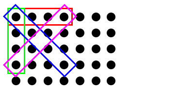

# Connect Four
Let's build Connect Four. Connect Four is played on a 5x7 grid. Players are
taking turns competing to get four tokens in a line. When you play you
effectively choose one column to drop a token in. The token falls down to the
last free spot in the column. 

We'll use the knowledge and experience we gained from building Tic Tac Toe.
Both games have a 2D grid. We'll need to make sure we prevent ourselves from
accessing indexes off the board. Both games have two players who alternate
turns. We'll need to make sure players only make valid moves and make sure we
keep track of the current player correctly.

There are two main "areas of research" we'll need to prove to ourselves we can
handle before we seriously start tackling this game. We need to make sure we
can #1: simulate dropping tokens in a column and having them fall to the
bottom. And, #2: be able to detect every possible winning condition.

The good news about these concepts is we can explore solutions for them
independently from building out the rest of the whole game. When you start
a new project it is important to prove to yourself that you can do the hardest
or most unknown things first. It's bad to build up architecture for something
you later find out is impossible to do. Anyone ever read the old "Wayside
School" books where the school built elevators where one only went up and one
only went down? Bad foresight right there.

Both of these concepts have some fun stuff in them. It's kind of exciting to
simulate dropping the tokens and we can add some animation to the program to
have a cool effect seeing the tokens drop in to place. For detecting winning
combinations we'll learn a conceptual technique involving a "jig" and a Ouija
board.

Let's look at dropping tokens in to place first.

## Dropping Tokens in to Place
The basic idea for dropping a token is to start at the bottom of a column
and search up to fill the first `None` you encounter. Remember to include
a check to make sure the column is at a legitimate index.

```python
def drop(col, token):
    if not is_valid(col):
        return False

    row = len(board)
    is_placed = False

    while row >= 0 and not is_placed:
      if board[row][col] == None:
          board[row][col] = token
          is_placed = True

    # return whether or not the token was actually placed
    return is_placed
```

This seems like pretty solid code. Let's write a small program to test the
correctness of the code. We want to make sure it never breaks with bad indexes,
drops tokens to the bottom of empty columns, drops them correctly in partially
filled columns and doesn't break when it tries to drop tokens on full columns.

Let's hard-code a board we can use to test these different cases:

```python
test_drop_board = [
    [None, None, None, None, None,  "O", None],
    [None, None, None, None,  "O",  "O", None],
    [None, None, None,  "O",  "O",  "O", None],
    [None, None,  "O",  "O",  "O",  "O", None],
    [None,  "O",  "O",  "O",  "O",  "O", None]
]
```

I'm writing a function to show what's in the board. I chose to put two empty
spaces `"  "` between columns because fonts in my terminal all about twice as
tall as they are wide. Putting the spaces between the columns makes the whole
grid appear more rectangular, as I would expect in Connect Four.

```python
def display_board(game):
    print("1  2  3  4  5  6  7")
    for row in game.board:
        line = "  ".join(row)
        print(line)
```

```python
game = ConnectFourGame()
game.board = test_drop_board

token = "X"
for column in range(-2, 10):
  result = drop(column, token)
    print("drop in column", column, result)

display_board(board)
```

Here's the output I get from running that test program. I ran in to some bugs
along the way, especially with how I was representing empty values (`None`, vs `" "`, vs `"."`). It's nice to take a small step and gain confidence I'm doing
the right things, squashing bugs as I go along rather than trying to figure
out what's wrong after the whole thing is complete. Test early and test often!

```txt
drop in column -2 False
drop in column -1 False
drop in column 0 True
drop in column 1 True
drop in column 2 True
drop in column 3 True
drop in column 4 True
drop in column 5 False
drop in column 6 True
drop in column 7 False
drop in column 8 False
drop in column 9 False
1  2  3  4  5  6  7
.  .  .  .  X  O  .
.  .  .  X  O  O  .
.  .  X  O  O  O  .
.  X  O  O  O  O  .
X  O  O  O  O  O  X
```

## Searching for Win Conditions
OK, searching for winning conditions in the grid is not a totally new concept,
but it's scaled up from what we were looking at in Tic Tac Toe. It's worth some
penciling on paper.

The number of places where winning combinations can occur in Connect Four is
much larger than the eight winning combinations a line could occur in Tic Tac
Toe. We're going to need to either enumerate out all possible winning locations
manually, or write code that searches for them. We'll learn a good technique
involving a "jig" and a "Ouija board" to search for all solutions.

There's 50 locations where four-in-a-row can occur on a 5x7 board.

* Horizontal: 4 positions per row * 5 rows = 20 possibilities
* Vertical: 2 positions per column * 7 columns = 14 possibilities
* Forward slash: 8 possibilities
* Back slash: 8 possibilities
* 50 total location possibilities

Here's a visual representation of the patterns we'll need to check for across
the grid. We need to check for four-in-a-row horizontally, vertically, in a
forward-slash diagonal and a back-slash diagonal.

Here's what all we're checking for:



Here's how we can pluck the values out for each of the four lines:

```python
h1, h2, h3, h4 = [0,0], [0, 1], [0, 2], [0, 3] # horizontal
v1, v2, v3, v4 = [0,0], [1, 0], [2, 0], [3, 0] # vertical 
f1, f2, f3, f4 = [0,0], [1, 1], [2, 2], [3, 3] # forward slash "\"
b1, b2, b3, b4 = [0,3], [1, 2], [2, 1], [3, 0] # back slash "/"
```

Now imagine sliding the entire arrangement of all the things we're checking for
across the grid. If we slide the top-left corner all around the grid so it
visits each dot then we can check the whole grid for every line arrangement.

I like to think of this as building a "jig" and scanning a across a Ouija
board. The jig is like a wood-working jig. Wood workers create jigs to hold
things in place while they build. Our jig is a conceptual jig. It holds in
place the locations of things we're looking for. We can move it across our
grid and see if it moves across any matches.

Wait, what about when the jig moves off the board so some of the parts are
reaching out of bounds? We'll fix this when we create a virtual interface
for the grid.

With the jig we can create two functions. One function is two for-loops that
traverse over the entire grid one spot at a time. This function represents
moving the jig spot by spot looking for win conditions. The second function
represents building the jig itself. The second function takes in a row/column
coordinate and looks at the four different line directions using relative
coordinates.

```python
def search(grid):
  for row in range(rows):
    for col in range(cols):
      is_winning = jig(grid, row, col)
      if is_winning:
        return True
  return False
```

```python
def jig(grid, row, col):
  # horizontal, vertical, forward-slash "\", back-slash "/"
  h1, h2, h3, h4 = [row+0, col+0], [row+0, col+1], [row+0, col+2], [row+0, col+3]
  v1, v2, v3, v4 = [row+0, col+0], [row+1, col+0], [row+2, col+0], [row+3, col+0]
  f1, f2, f3, f4 = [row+0, col+0], [row+1, col+1], [row+2, col+2], [row+3, col+3]
  b1, b2, b3, b4 = [row+0, col+3], [row+1, col+2], [row+2, col+1], [row+3, col+0]

  is_h = four_match(grid, h1, h2, h3, h4)
  is_v = four_match(grid, v1, v2, v3, v4)
  is_f = four_match(grid, f1, f2, f3, f4)
  is_b = four_match(grid, b1, b2, b3, b4)
  return is_h or is_v or is_f or is_b
```

```python
def four_match(grid, c1, c2, c3, c4):
  p1 = grid[c1[0], c1[1]]
  p2 = grid[c2[0], c2[1]]
  p3 = grid[c3[0], c3[1]]
  p4 = grid[c4[0], c4[1]]

  p1_is_not_none = p1 is not None
  all_match = p1 == p2 and p2 == p3 and p3 == p4
  return p1_is_not_none and all_match
```

## Virtual Grid Interface
Calling this a "virtual grid interface" makes it sounds fancy. What we're
going here is actually not that dramatic. Sometimes its just nice to make
things sound exciting.

The virtual grid interface is going to be a function called `get(grid, row,
col)` that returns the value at the row/column coordinate, or returns an
empty value if the row/column coordinate is not a legitimate position. This
allows us to write code like with the jig above that searches across the
entire grid without worrying about parts of the jig extending off the actual
grid.

What we're creating here is basically an upgraded `is_valid(grid, row, col)`
function. Instead of just returning `True` or `False` if the coordinate is
valid, it will just return empty values for any invalid coordinate.

```python
def get(grid, row, col):
  if not is_valid(grid, row, col):
    return None
  return grid[row][col]
```

Tada! Our own very very fancy Virtual Grid Interface.

## Putting It All Together
Now we've seen everything we need to build to program our own version of Connect Four.
Here's the pieces we put together:

* A 2D array to represent the 5x7 grid.
* A drop function that drops tokens into the first available space in a column.
* A "jig" that we move over the 2D array to search for winning line locations.
* A virtual grid interface that saves our jig from accessing the grid out of bounds.
* A class that holds the grid, these methods and keeps track of players and the
  turn number.


## Alternative Approach: .appending() Tokens in to Place
It would be possible to represent the grid in another way too. Instead of
hard-coding the grid as a 5x7 2D array to begin with, we can create an array
containing a list of empty arrays to represent the columns. Then when we drop
tokens into a column we simply append to the end of an empty array.

Although this idea will simplify dropping tokens it comes at the cost of
doing more work elsewhere. We will need to rewrite the `display_board` and
virtual `get()` functions to account for the new structure.

I'm renaming this from `board` to `columns` to indicate that this is a list
of all the columns.

```python
columns = [[], [], [], [], [], [], []]
```

This greatly simplifies the `drop()` method. It comes at the cost of
complicating the `display_board()` method.

```python
def drop(col, token):
    # check to make sure it's a legitimate column index
    if col < 0 or col >= len(self.columns):
      return False

    # check to make sure the column isn't full
    if len(self.columns[col]) >= COLUMN_MAX_TOKENS:
      return False
    
    # add the token to the end and report success!
    self.columns[col].append(token)
    return True
```

Although writing the code to drop tokens in to place becomes a breeze it
makes thinking about the structure of the columns a bit harder to reason
about. The board appears flipped sideways if we draw out the array structure.

Here's what the `test_drop_board` looks like in this column format. 

```python
test_drop_columns = [
  [],
  ["0"],
  ["0", "0"],
  ["0", "0", "0"],
  ["0", "0", "0", "0"],
  ["0", "0", "0", "0", "0"],
  [],
]
```

We need to write a `display_columns` function that flips the array structure
sideways back in to the way we expect it to look.

When we look at the array structure the elements on the left are the bottom
row of the column. When we print it out we need to print from the top to the
bottom. We need to write something that checks to see if columns have tokens
filled in far to the right and to print empty values if nothing is there.

```python
def display_columns(columns):
  row = 4
  while row <= 0:
    line = ""
    for col in range(0, 7):
      if len(columns[col]) <= row:
        line += ".  "
      else:
        line += columns[col][row] + "  "
    
    print(line)
    row -= 1
```

Here's the new virtual grid interface for the column format. There's one
especially non-obvious line where we need to convert the `row` index into 
a different number to account for how rows are stored in this format.

The way the columns store the rows the row at index zero is the bottom row.
All the code we've written before from the full 2D array grid structure the
row at index zero is the top row. We need to write one line that converts
the row index to how the rows are actually stored in this system.

We'll write `column_row = 4 - grid_row`. Consider the following cases:

* Accessing the bottom-left row in grid coordinates is `(grid_row: 4, col: 0)`.
* The actual array index in the column format is `columns[0][0]`.
* The formula `column_row = 4 - 4` gives us `0`, which is correct.


* Accessing the top-left row in grid coordinates is `(grid_row: 0, col: 0)`.
* The actual array index in the column format is `columns[0][4]`.
* The formula `column_row = 4 - 0` gives us `4`, which is correct.

```python
def get_columns(columns, grid_row, col):
  if col < 0 or col >= len(columns):
    return None

  # the parameter `grid_row` uses grid coordinates where the top row is at index zero.
  # we need to account for that because the bottom row is at index zero in this format.
  column_row = 4 - grid_row    

  if column_row >= len(columns[col]):
    return None
  return columns[col][column_row]
```

## What's Better?
So which board representation is better? Is it better to have a simple `drop()`
method that appends to arrays, or is it better to have a nice `display_board()`
function combined with a `drop()` method that searches up from the bottom for
open spots?

Sorry, I can't speak to which is better! I can only tell you the ramifications
of each. Choose for yourself the aspects of either you prefer. 

We still need to explore what it takes to search for winning lines of
four-in-a-row. It will definitely be easier to begin our explorations here with
the full-fleshed 2D grid to make all our array accesses easier. Later we'll
look at a technique that will make it easy to access grid coordinates (even if
they don't exist!) through a sort of virtual interface.

## Source Code
**main.py**
```python
from connect_four_game import ConnectFourGame


def display_board(game):
    print()
    print("1  2  3  4  5  6  7")
    for row in game.board:
        line = "  ".join(row)
        print(line)


def prompt_player(game):
    player = game.get_current_player()
    print("%s: make a move: " % player, end="")
    column = int(input()) - 1
    return column


def display_winner(game):
    display_board(game)
    if game.winner is None:
        print("CATS! The game ended in a tie.")
    else:
        print(game.winner, "won!")


def main():
    game = ConnectFourGame()
    while not game.is_game_over:
        display_board(game)
        column = prompt_player(game)
        game.make_move(column)
    display_winner(game)


main()
```

**connect_four_game.py**
```python
EMPTY = "."


class ConnectFourGame:

    def __init__(self):
        self.reset()

    def reset(self):
        self.is_game_over = False
        self.winner = None

        self.turn = 0
        self.players = ["X", "O"]

        self.board = [
            [EMPTY, EMPTY, EMPTY, EMPTY, EMPTY, EMPTY, EMPTY],
            [EMPTY, EMPTY, EMPTY, EMPTY, EMPTY, EMPTY, EMPTY],
            [EMPTY, EMPTY, EMPTY, EMPTY, EMPTY, EMPTY, EMPTY],
            [EMPTY, EMPTY, EMPTY, EMPTY, EMPTY, EMPTY, EMPTY],
            [EMPTY, EMPTY, EMPTY, EMPTY, EMPTY, EMPTY, EMPTY]
        ]

    def make_move(self, col):
        if not self.is_valid(col=col):
            return False

        player = self.get_current_player()
        is_dropped = self.drop(col, player)
        if is_dropped:
            self.turn += 1
            if self.is_winning():
                self.is_game_over = True
                self.winner = player
            elif self.turn == 35:
                # the game ends if the board has filled up
                self.winner = None
                self.is_game_over = True

    def get_current_player(self):
        index = self.turn % len(self.players)
        player = self.players[index]
        return player

    def get(self, row, col):
        if not self.is_valid(row, col):
            return EMPTY
        return self.board[row][col]

    def is_valid(self, row=0, col=0):
        if row < 0 or row >= len(self.board):
            return False
        if col < 0 or col >= len(self.board[row]):
            return False
        return True

    def drop(self, col, token):
        if not self.is_valid(col=col):
            return False

        row = len(self.board) - 1
        is_placed = False

        while row >= 0 and not is_placed:
            if self.board[row][col] == EMPTY:
                self.board[row][col] = token
                is_placed = True
            row -= 1

        # return whether or not the token was actually placed
        return is_placed

    def is_winning(self):
        has_winner = self.search()
        if has_winner:
            return True

    def search(self):
        rows, cols = 5, 7
        for row in range(rows):
            for col in range(cols):
                is_winning = self.jig(row, col)
                if is_winning:
                    return True
        return False

    def jig(self, row, col):
        # gah, the lines were just too long when using "row" and "col"
        r, c = row, col

        # horizontal, vertical, forward-slash "\", back-slash "/"
        h1, h2, h3, h4 = [r+0, c+0], [r+0, c+1], [r+0, c+2], [r+0, c+3]
        v1, v2, v3, v4 = [r+0, c+0], [r+1, c+0], [r+2, c+0], [r+3, c+0]
        f1, f2, f3, f4 = [r+0, c+0], [r+1, c+1], [r+2, c+2], [r+3, c+3]
        b1, b2, b3, b4 = [r+0, c+3], [r+1, c+2], [r+2, c+1], [r+3, c+0]

        is_h = self.four_match(h1, h2, h3, h4)
        is_v = self.four_match(v1, v2, v3, v4)
        is_f = self.four_match(f1, f2, f3, f4)
        is_b = self.four_match(b1, b2, b3, b4)
        return is_h or is_v or is_f or is_b

    def four_match(self, c1, c2, c3, c4):
        p1 = self.get(c1[0], c1[1])
        p2 = self.get(c2[0], c2[1])
        p3 = self.get(c3[0], c3[1])
        p4 = self.get(c4[0], c4[1])

        p1_is_not_none = p1 is not EMPTY
        all_match = p1 == p2 and p2 == p3 and p3 == p4
        return p1_is_not_none and all_match
```
