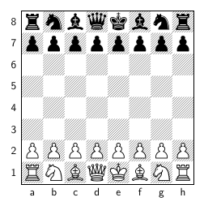

# Chess
Finally, we go on to the greatest game!

This chapter covers how to represent the board, how to share common code between
pieces, how to program the basic moves of individual pieces, how to account for
the special piece moves (like castling, en passant, and promotion), and how to
detect checks, stalemates and checkmates.

This chapter also briefly surveys how to implement poorly performing chess AIs
inspired by the imagination of "tom7" DR. Tom Murphy VII PH.D. Wait, why would
we implement poorly performing chess AIs? Well, they're a lot easier to build
than highly performing chess AIs!

## The Board


The chess board is a 8x8 grid. Pieces always begin set up in one fixed
arrangement. We will hard-code this arrangement.

Chess players refer to squares on the board using `a1` to describe the
bottom-left corner and `e4` for the space two squares ahead of white's
king pawn. To make our programming easier we will refer to squares as
array indices. 

Representing the board with a 2D array the top left corner is at `[0][0]` or
`a8`.  `a1` is at array position `[7][0]`. Black's queen pawn at `d7` is at
array position `[1][3]`. `e4` is at array position `[4][4]`. 

We can write functions to convert both ways back and forth between chess
notation and array indices. Creating these two conversions is useful because now
we can translate either way between both systems.

```js
// 'a8' returns {row: 0, col: 0}
// 'a1' returns {row: 0, col: 7}
// 'd7' returns {row: 1, col: 3}
// 'e4' returns {row: 4, col: 4}
function positionToIndex(position) {
    let rank = position[1];    
    let file = position[0];    

    let rowIndex = '87654321'.indexOf(rank);
    let colIndex = 'abcdefgh'.indexOf(file);

    return {row: rowIndex, col: colIndex};
}

function indexToPosition(row, col) {
    let rank = '87654321'[row];
    let file = 'abcdefgh'[col];
    let position = file + rank;
}
```

We can hard-code the creation of an initial board by writing out an 8x8
two-dimensional array. And we can hard-code the initial arrangement of the
pieces and their colors too. Hard-coding in this instance doesn't take too long
to write out by hand so we don't need to worry about over-optimizing or
eliminating each piece of redundancy.

```js
var board = [
    [null, null, null, null null, null, null, null],
    [null, null, null, null null, null, null, null],
    [null, null, null, null null, null, null, null],
    [null, null, null, null null, null, null, null],
    [null, null, null, null null, null, null, null],
    [null, null, null, null null, null, null, null],
    [null, null, null, null null, null, null, null],
    [null, null, null, null null, null, null, null],
]
```

```js
var board = [
    [new Rook(0), new Knight(0), new Bishop(0), new Queen(0), new King(0), new Bishop(0), new Knight(0), new Rook(0)],
    [new Pawn(0), new Pawn(0), new Pawn(0), new Pawn(0), new Pawn(0), new Pawn(0), new Pawn(0), new Pawn(0)],
    [null, null, null, null null, null, null, null],
    [null, null, null, null null, null, null, null],
    [null, null, null, null null, null, null, null],
    [null, null, null, null null, null, null, null],
    [new Pawn(1), new Pawn(1), new Pawn(1), new Pawn(1), new Pawn(1), new Pawn(1), new Pawn(1), new Pawn(1)],
    [new Rook(1), new Knight(1), new Bishop(1), new Queen(1), new King(1), new Bishop(1), new Knight(1), new Rook(1)],
]
```

If we care about reducing redundancy we can use for loops to eliminate the
repetitiveness of creating pawns and writing out the four empty rows in the
middle.

```js
let board = [];

// Set up black's pieces
let blackBackRow = [new Rook(0), new Knight(0), new Bishop(0), new Queen(0), new King(0), new Bishop(0), new Knight(0), new Rook(0)];
let blackFrontRow = new Array(8);
for (let i = 0; i < blackFrontRow.length; i++) {
    blackFrontRow[i] = new Pawn(0);
}

// Add four empty rows for the middle of the board
for (let i = 0; i < 4; i++) {
    board.push(new Array(8))
}

// Set up white's pieces
let backRow = [new Rook(0), new Knight(0), new Bishop(0), new Queen(0), new King(0), new Bishop(0), new Knight(0), new Rook(0)];
let frontRow = new Array(8);
for (let i = 0; i < frontRow.length; i++) {
    frontRow[i] = new Pawn(0);
}
```

We can go even further and eliminate the redundancy of writing out the order the
back row for black and white in two different spots. Create a function called
`createPieces` that accepts `color` as a parameter. The function returns an object
with properties `frontRow` (pawns) and `backRow` so we can pluck these two rows off
and arrange them on the overall board correctly.

```js
function createPieces(color) {
    let frontRow = (new Array(8)).map(() => new Pawn());
    let backRow = [new Rook(), new Knight(), new Bishop(), new Queen(), new King(), new Bishop(), new Knight(), new Rook()];

    // add the color for each piece
    frontRow.forEach(piece => piece.color = color);
    backRow.forEach(piece => piece.color = color);

    return {frontRow, backRow};
}

function createBoard() {
    let board = new Array(8);
    let blackPieces = createPieces('black');
    let whitePieces = createPieces('white');

    board[0] = blackPieces.backRow;
    board[1] = blackPieces.frontRow;

    for (let i = 2; i < board.length - 2; i++) {
        board[i] = new Array(8);
    }

    board[board.length - 2] = whitePieces.frontRow;
    board[board.length - 1] = whitePieces.backRow;
}
```

## Moving Pieces
A classic chess opening is moving the white king pawn up to spaces to control
the center. Let's write a function that manipulates our board to make that move.

In chess players write this move down as `e4`. Chess has a whole notation with
rules about how to write down moves. The intricacies of chess notation is
fascinating. We would be putting the cart in front of the horse if we
rabbit-holed into creating a program that understands and manipulates the board
by receiving commands in chess notation. We need to use our own simpler chess
notation.

We will initially manipulate our chess board by specifying the exact starting
square and the exact ending square of the piece being moved. We can build more
sophisticated ways to interface with the board on top of this basic
functionality.

```
e2 to e4
6,4 to 4,4
```

Writing down either format of these is fine because we can already translate
between the two ways to refer to those squares. Inside the program we will
standardize on manipulating array index coordinates. This means we can refer to
position like `e2` and `e4` but inside the program we will immediately convert
those formats to the array index format.

Notice how `makeMoveByPosition` does nothing else but perform a conversion and
immediately feed into `makeMoveByIndex`.

```js
function makeMoveByPosition(board, startPosition, endPosition) {
    let startIndex = positionToIndex(startPosition);
    let endIndex = positionToIndex(endPosition);
    makeMoveByIndex(board, startIndex.row, statIndex.col, endRow.row, endCol.col);
}

function makeMoveByIndex(board, startRow, startCol, endRow, endCol) {
    let startPiece = board[startRow][startCol];
    let endPiece = board[endRow][endCol];

    board[startRow][startCol] = null;
    board[endRow][endCol] = startPiece;
}
```

## Validating Moves
Making moves is easy. The more challenging part of programming chess is
enforcing the game such that the player can only play legitimate moves!

Each piece in chess moves in its own way. Let's enumerate how each piece moves
and make a note of unique aspects about how that piece moves differently than
other pieces. This analysis will allow us to gain a sense of what sort of things
we'll need to program.

Which piece do you think is going to be the easiest to program?  We will
immediately see that simple-seeming pieces have unexpected complexities!

* Pawns only move forward one space
    * But they can move forward two spaces on their first turn
    * And they attack diagonally, a different direction than how they regularly move
    * And they have a special move called "en passant" that only occurs in a special circumstance
    * And they have a special ability where they promote and turn into another piece if they reach the
      other side of the board
* Bishops move and attack diagonally
* Rooks move and attack orthogonally
* Queens move and attack diagonally or orthogonally
* Kings move any one square diagonally or orthogonally
    * The king may not move to a space where it is under attack.
    * The king must move to a free space if it is currently under attack.
* Knights move and attack in a specific pattern
    * The pattern is not in a straight line like attacking diagonally or orthogonally.
    * Their movement is uninhibited by pieces between their start square and end square.

In order to not bury the headline here are some concepts we'll have to program
to meet the requirements of making moves for all of the pieces:

* Since pieces move along a line until they're blocked by another piece we'll
  need to program something that collects a set of legitimate squares up to and
  including the impeding square.
* We'll need to program something that accounts for the fact that pawns, unlike
  any other piece, attack in a different direction than they move.
* We'll need to program something that collects and combines legitimate squares
  starting from one square and looking in multiple directions.
* We'll need to program something that makes certain pieces aware of the history
  of the game so pawns only move forward two squares once, to support the special
  circumstance of en passant, to make sure kings only castle once per game and to
  prevent kings from castling after either a king or rook have moved.
* We'll need to program something that collects all the squares enemy pieces are
  threatening to attack to prevent the king from moving to a threatened square.
* We'll need to handle a special post-move circumstance to support pawns promoting
  into other pieces after reaching the final rank.

If you guessed pawns would be the easy piece to program you may have been
surprised! The simple one-square-moving piece has a lot of exceptional cases!

Bishops, Rooks, and Queens are relatively easy to program but we'll need to
account for the fact that their movement is inhibited when other pieces are in
their way.  For example, although a Queen has the range to move in any direction
all across the board the Queen has zero legitimate moves at the beginning of the
game because the Queen is surrounded in every direction!

The King seems simple to program moves for since the king only moves one square
in any direction at a time. But the fact that the king may not move into a square
where another piece can attack means that properly programming the king relies on
properly programming the attacks of every other piece first!

In the end Knights are the easier piece to program. They move according to a
pattern that is ultimately a fixed number of positions around the piece and
those positions are completely unaffected by pieces between the knight and their
destination. Nothing ever gers in the way of a knight. The only place a knight
can't legally move is off the board.

Let's begin validating piece movement starting by programming to make sure it is
illegal to move pieces off the board.

```js
function isValidIndex(board, row, col) {
    if (row < 0 || col < 0) {
        return false;
    }

    if (row >= board.length) {
        return false;
    }

    if (row[col] >= board[row].length) {
        return false;
    }

    return true;
}
```

Now we can update `makeMoveByIndex` to check for valid positions using `isValidIndex`.

```js
function makeMoveByIndex(board, startRow, startCol, endRow, endCol) {
    if (isValidIndex(board, startRow, startCol)) {
        return false;
    }

    if (isValidIndex(board, endRow, endCol)) {
        return false;
    }

    let startPiece = board[startRow][startCol];
    let endPiece = board[endRow][endCol];

    board[startRow][startCol] = null;
    board[endRow][endCol] = startPiece;

    return false;
}
```

## Gathering All Possible Movement
Bishops, Rooks and Queens all move rather similarly. They move in a straight
line in one direction until another piece impedes their movement in which case
the moving piece either stops if the other piece is friendly, or the moving
piece captures another piece and lands on the square.

Let's start with Rook moves and program a function that starts at one square and
finds all the valid moves up, down, left and right from one piece. The function
will return a list of every valid move.

```js
function rookMoves(board, startRow, startCol) {
    let moves = [];

    // up
    let row = startRow;
    let col = startCol;
    let isBlocked = false;
    while (!blocked && row >= 0) {
        row -= 1;
        if (!isValidIndex(board, row, col)) {
            isBlocked = true;
        } else {
            let piece = board[row][col];
            if (piece.color === board[startRow][startCol]) {
                isBlocked = true;
            } else {
                moves.push({row, col});
            }
        }
    }

    // down
    let row = startRow;
    let col = startCol;
    let isBlocked = false;
    while (!blocked && row >= 0) {
        row += 1;
        if (!isValidIndex(board, row, col)) {
            isBlocked = true;
        } else {
            let piece = board[row][col];
            if (piece.color === board[startRow][startCol]) {
                isBlocked = true;
            } else {
                moves.push({row, col});
            }
        }
    }

    // left
    let row = startRow;
    let col = startCol;
    let isBlocked = false;
    while (!blocked && row >= 0) {
        col -= 1;
        if (!isValidIndex(board, row, col)) {
            isBlocked = true;
        } else {
            let piece = board[row][col];
            if (piece.color === board[startRow][startCol]) {
                isBlocked = true;
            } else {
                moves.push({row, col});
            }
        }
    }

    // right
    let row = startRow;
    let col = startCol;
    let isBlocked = false;
    while (!blocked && row >= 0) {
        col += 1;
        if (!isValidIndex(board, row, col)) {
            isBlocked = true;
        } else {
            let piece = board[row][col];
            if (piece.color === board[startRow][startCol]) {
                isBlocked = true;
            } else {
                moves.push({row, col});
            }
        }
    }


    return moves;
}
```

Writing those four while loops is redundant! Plus that's only written in one
piece for the Rook so far.  We would have to write that four more times to
account for the diagonals for a bishop, and eight times for each direction the
queen moves in.

We can take one step away from redundancy and make a function that starts at a
square and gathers valid movement spaces in one direction. Then we can combine
all of these valid movements together into one large list of valid movements.

Take a look at this level of reducing redundancy then we'll see how we can
reduce redundancy ever further by making the directions even more abstract and
really sharing this code between pieces.

```js
function movementSquares(board, startRow, startCol) {
    // search for moves in every direction
    const up = getSquaresInDirection(board, startRow, startCol, -1, 0);
    const down = getSquaresInDirection(board, startRow, startCol, 1, 0);
    const left = getSquaresInDirection(board, startRow, startCol, 0, -1);
    const right = getSquaresInDirection(board, startRow, startCol, 0, 1);
    return [...up, ...down, ...left, ...right];
}

function getSquaresInDirection(board, startRow, startCol, rowDirection, colDirection) {
    // create an array to collect all moves in this direction
    let moves = [];

    let steps = 0;
    let isSearching = true;
    while (isSearching) {
        steps++;

        let row = startRow + steps * rowDirection;
        let col = startCol + steps * colDirection;

        // stepped off the board
        if (!isValidIndex(row, col)) {
            isSearching = false;
        }

        // if the piece on this square is the same color as the starting piece
        // then the square is not added because we are blocked by our own piece
        let piece = board[row][col]
        if (piece.color !== board[startRow][startCol].color) {
            isSearching = false
        }

        moves.push({row, col});

        // stop searching if the row contained an enemy piece because the
        // furthest a piece can move is capturing that piece.
        if (piece !== null) {
            isSearching = false
        }
    }
    return moves;
}

```

If the piece is their own color they stop in front of it. If the piece is
another color they capture the piece, take that piece off the board and land on
that piece's space.


Let's program tools that gather all the valid movements for a piece. We want to
reuse these tools between pieces. I imagine one tool will check for valid
movements in one direction, then a second tool will combine the movements from
all directions into one set of valid moves. We can also