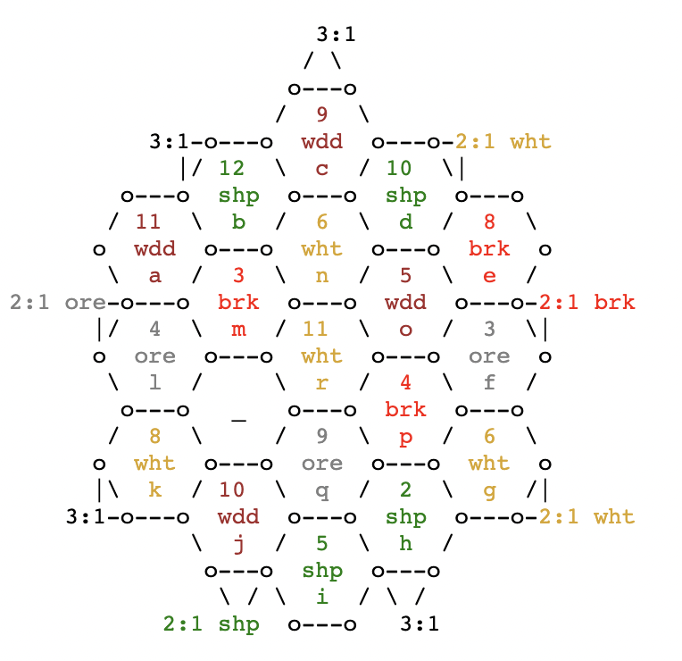
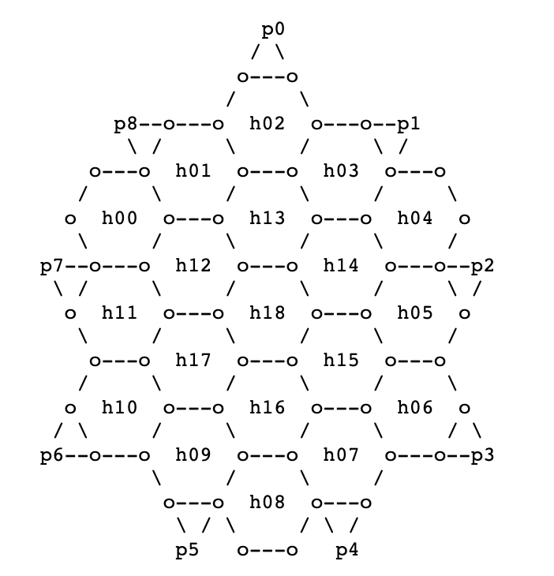
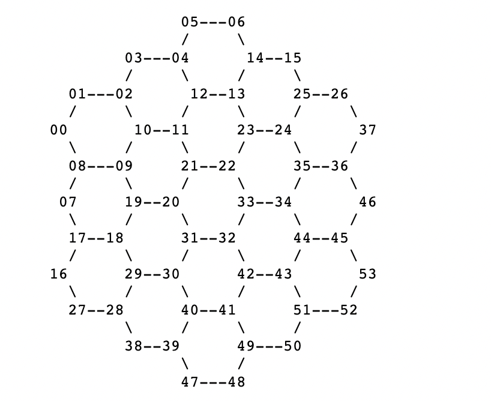
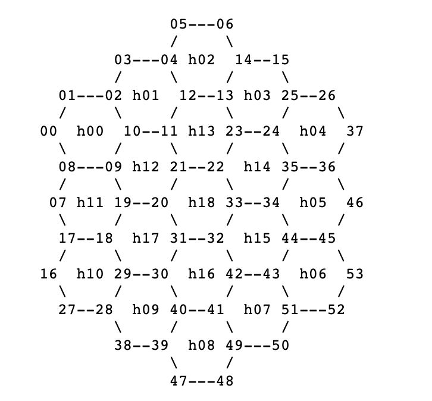

# So, You Want to Program Setters of Catan?
Here's what we'll need to know!

* How to represent the board of hexagons
* Allow players to place pieces on the board
* Distribute resources to players according to dice rolls
* Write an algorithm to determine who has Longest Road
* Count points to determine end game and winner

Trading is also something we'll need to figure out, but we will talk about
it later.

There are two hard parts to programming Settlers of Catan. Representing the
board made up of hexagons, and writing an algorithm to determine who has the
longest road. Neither of these tasks are trivial.

For the hex grid we can build a rapid prototype first. We'll hard code hexes
for just the 2-4 player sized board. This prototype will allow us to test out
other ideas to see if we're on the right track. Eventually we'll upgrade our
hard-coded hex grid to something properly parameterized that can represent
hex grids of arbitrary sizes.

In order to determine which player has the longest road we need to learn
about a data structure called a Graph. Graphs are great at representing the
connections between things. Graphs are comprised of "nodes" and "edges." You
can use graphs to model streets and intersections in a city, or relationships
between users on social media, and much much more! We will use graph nodes to
represent corners on hexagons where players can build settlements and cities.
We will use graph edges to represent the edges of hexagaons where players can
build roads.

The benefit of using a Graph here is there are all sorts of well-known
algorithms suited exactly for the data structure. We will look at common
graph algorithms and find one we can tweak to build something that will
tell us which player has the longest road.

Let's get rolling!

## Referring to Positions on the Board
Here's a standard board setup. This board has 19 hexagon tiles and 9 ports
where each port covers two corners of a hexagon. Each of these tiles has a
letter associated it ranging from `A` to `R`. The desert tile has no letter,
we will refer to it with an underscore `_`.

We need this system so we can distribute resources on dice rolls, and know
where to place the robber and where to build build roads and settlements.

After we get the board set up we'll work on the algorithm to determine who
has the longest road.



We need to create a system that allows us to reference every position on
the board. We need to be able to refer to each corner of a hexagon so players
can specify where they're placing settlements or cities, we need to be able to
refer to each edge of a hexagon so players can specifiy where they're building
roads, and we need a way to refer to each each so we can look up what number
and resource is assocaited with the tile.

While we  program this hard-coded version of the board we will use the letters
of the tiles to refer to every position on the board. We can interact with the
board by typing in letters. This allows us to interact with the game without
a graphical user interface. Once we prove to ourselves we can build a strong
foundation of the game we will upgrade the program with a proper UI and build
up mouse interactions.

Here's how we will refer to every position on the board for now:

* Refer to tiles by their letter `A-R`, or underscore `_` for the desert.
* Refer to edges by tile letter, a dash `-`, and direction, like `C-NW`.
* Refer to corners by tile letter, a period `.`, and direction, like `C.NW`.

Notice there is difference between the possible edge directions and corner
directions. Edges have north and south, where corners do not have straight
north and south. Corners have straight east and west where edges do not have
straight east and west.

* Valiud edge directions are `N`, `S`, `NW`, `NE`, `SW` and `SE`.
* Valid corner directions are `E`, `W`, `NW`, `NE`, `SW` and `SE`.

* A player can place a robber on a tile by specifying tile `Q`.
* A player can build a road by specifying edge `C-SW` or `B-NE`.
* A player can build a settlement by specifying `C.SW` or `B.E`.

I really like another nomenclature system too, but it is not rigid enough.
This system leaves ambiguity when refering to corners and edges on the outside
border where corners and edges only touch the sea. Still, I'm including it
to show another possible system.

* Refer to tiles the same way, by their letter.
* Refer to edges with a dash `-` and two letters, like `-AB`.
* Refer to corners with a dot `.` and three letters, like `.PHQ`.

Again, I really like this system, but let's see how it is ambiguous for outer
regions. If you try to play a settlement on the top `3:1` port on the wood tile
there are not enough neighbor tiles to specify an exact location. 

In this system the top tile `C` has these six corners.

The first four corners are unambiguous. 

* `.CB` or `C-W`
* `.CBN` or `C-SW`
* `.CND` or `C-SE`
* `.CD` or `C-E`

These last two top corners don't have enough neighbors to disambiguate:

* `.C` or `C-NW`
* `.C` or `C-NE`

As much as I love the system that just punches in tile letters, it seems we
need to rely on the more thorough system with the directions.

## Best of Both Worlds?
But what if we could combine the two systems? Perhaps we can allow players
to use the "tile intersection coordinates" normally and write our program
so it prompts the player to disambiguate their choice if they ever specify
a coordinate that could refer to multiple positions.

Honestly, I may be bending over backward trying to get my "tile intersection
coordinate" scheme to work. It would certainly be easier to program this game
if we use absolute directional coordinates all the time. It might even be a
better experience for the user if they only have to think in one coordinate
system. But, I'm stubborn, and I'm going to try to combine these two coordinate
systems.

The general idea is this: prefer tile-intersection coordinates. If the
coordinates are ambiguous then the program should provide a prompt for
the user to disambiguate where they mean. The program should simultaneously
allow users to enter absolute directional coordinates from any prompt too.

This means we will need to know when a tile-intersection coordinate is
ambiguous and be able to provide disambiguation options.

## Hard-Cording a Board
For now we will hard-code the board. We'll look more in to hex grids and how
to program those later. We're hard-coding it for now to prove we have the
right idea about programming this game. Before we go to the trouble of
building out a fancy hex grid system let's make sure we are on a good
foundation to do simpler things like distribute resources on dice rolls,
place the robber, and allow players to build roads and settlements. Also,
we'll need to write that algorithm to determine who has the longest road,
which is no easy feat.

Here's the board again:


First, let's create each tile and make sure the tile has its letter, resource
and number. Buckle up, this is some redundant hard-coded code!

```
let tiles = [
    new Tile("A", Resources.WOOD, 11),
    new Tile("B", Resources.SHEEP, 12),
    new Tile("C", Resources.WOOD, 09),
    new Tile("D", Resources.SHEEP, 10),
    new Tile("E", Resources.BRICK, 08),
    new Tile("F", Resources.ORE, 03),
    new Tile("G", Resources.WHEAT, 06),
    new Tile("H", Resources.SHEEP, 02),
    new Tile("I", Resources.SHEEP, 05),
    new Tile("J", Resources.WOOD, 10),
    new Tile("K", Resources.WHEAT, 08),
    new Tile("L", Resources.ORE, 04),
    new Tile("M", Resources.BRICK, 03),
    new Tile("N", Resources.WHEAT, 06),
    new Tile("O", Resources.WOOD, 05),
    new Tile("P", Resources.ORE, 04),
    new Tile("Q", Resources.ORE, 09),
    new Tile("R", Resources.WHEAT, 11),
    new Tile("_", Resources.DESERT, 0),
]
```

```
// 4 wood, wheat and sheep
// 3 brick and ore
// 1 desert
// 19 total
let resources = [
    Resources.WOOD, Resources.WOOD, Resources.WOOD, Resources.WOOD,
    Resources.WHEAT, Resources.WHEAT, Resources.WHEAT, Resources.WHEAT,
    Resources.SHEEP, Resources.SHEEP, Resources.SHEEP, Resources.SHEEP,
    Resources.BRICK, Resources.BRICK, Resources.BRICK,
    Resources.ORE, Resources.ORE, Resources.ORE,
    Resources.DESERT,
]

shuffle(resources)

let tiles = [
    new Tile(), new Tile(), new Tile(),
    new Tile(), new Tile(), new Tile(), new Tile(),
    new Tile(), new Tile(), new Tile(), new Tile(), new Tile(),
    new Tile(), new Tile(), new Tile(), new Tile(),
    new Tile(), new Tile(), new Tile(),
]

// keep a seperate count for the number token since
// we will skip one token when we place the desert
let numberTokenIndex = 0

// the numbers in their specific order
// 18 numbers total (one less than 19 for the desert)
let numbers = [11, 12, 9, 10, 8, 3, 6, 2, 5, 10, 8, 4, 3, 6, 5, 4, 9, 11]
let letters = "ABCDEFGHIJKLMNOPQR"

// iterate over the tiles and assign their number and resource
// if the resource is the desert then do not assign a number
for (let i = 0; i < tiles.length; i++) {
    let tile = tiles[i];
    let resource = resources[i];

    // make sure the tile has a resource
    tile.resource = resource;
    
    // only place a number token if the resource is not the Desert
    if (resource !== Resources.DESERT) {
        tile.number = numbers[numberTokenIndex]
        tile.letter = letters[numberTokenIndex]

        numberTokenIndex++
    } else {
        tile.letter = "_"
    }
}

// Build a reverse lookup table so we can get tiles associated with
// each dice roll. Skip 1 because you can't roll a 1 with two dice,
// and skip 7 because rolling 7 activates the robber.
let numberToTile = {
    02: [], 03: [], 04: [], 05: [], 06: [],
    08: [], 09: [], 10: [], 11: [], 12: [],
}

// add each tile to its number reverse lookup
tiles.forEach(tile => {
    numberToTile[tile.number].push(tile)
})
```

This sets up the tiles with their numbers and resources but it doesn't
yet capture their positions on the board related to one another.

## Hard-Coding Coordinates


OK, dang it, there's another weird thing here. We're using the letters
on the number tiles to refer to the positions of each hex. But, the way
the board is normally laid out the positions of the letters actually change.
When you place the number tokens you skip placing a token for the desert.
Since the resources tiles are all shuffled the desert may appear in any
location.

We hard-coded the array of hexagons without any resource or number to begin
with. We will use the position of the "bare hexagon tile" in the array to
hard-code the corners and edges.

Notice the board has a slanted pattern of a row of three hexagons, then four,
then five in the mniddle, then four again and three in the last row. We will
use this pattern to give our code some semblance of structure to make this
easier to reason about.

Let's use the same sort of pattern with the corners of the hexagons to build
those up. And the same pattern again to build up the edges.

54 total corners:
* 07 corners in the top left row of corner points
* 09 in the next row of corner points
* 11 in the top middle row of corner points
* 11 in the bottom middle row of corner points
* 09 corner points in the second to last row
* 07 corner points in the last row

72 total edges:

* 06 winding snake edges across the top of tiles `ABC`
* 04 parallel edges in the next row across tiles `ABC`
* 08 winding snake edges on top tiles `LMND`
* 05 parallel edges across tiles `LMND`
* 10 winding snake edges across the top of tiles `K_ROE`
* 06 parallel edges across tiles `K_ROE`
* 10 winding snake edges on the bottom of tiles `K_ROE`
* 05 parallel edges across tiles `JQPF`
* 08 winding snake edges on the bottom of tiles `JQPF`
* 04 parallel edges across tiles `IHG`
* 06 winding snake edges on the bottom of tiles `IHG`


Yikes! That is a lot of corners and edges! Who knew?!

Worse, let's do some quick math to see how many ways there are to refer
to each of these corners and edges. 

* 19 hexagon tiles
* 54 total unique shared corner points
* 72 total unique shared edges.

`19` hexagons * `6` corners per hexagon = `114` absolute corner coordinates.
`19` hexagons * `6` edges per hexagon = `114` absolute edge coordinates.

So there's `114` ways to absolutely refer to all the corners, but there's
really only `54` corners. There are multiple absolute ways to refer to the
same corner or edge.

Let's hard-code it up!





```js
addCorners(h00, c00, c01, c02, c10, c09, c08)
addCorners(h01, c02, c03, c04, c12, c11, c10)
addCorners(h02, c04, c05, c06, c14, c13, c12)

addCorners(h11, c07, c08, c09, c19, c18, c17)
addCorners(h12, c09, c10, c11, c21, c20, c19)
addCorners(h13, c11, c12, c13, c23, c22, c21)
addCorners(h03, c13, c14, c15, c25, c24, c23)

addCorners(h10, 
addCorners(h17,
addCorners(h18,
addCorners(h14,
addCorners(h14,

```
